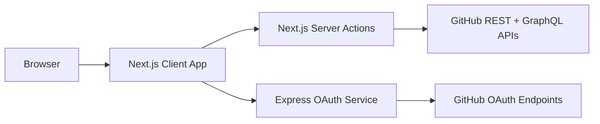
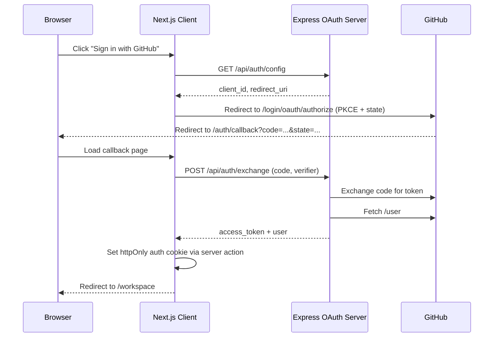

# Architecture

## High-Level System

## Services

### Frontend (`client/`)

- Framework: Next.js App Router + React
- Responsibilities:
  - UI rendering
  - Auth flow initiation and callback handling
  - Server actions for GitHub data read/write
  - Route protection via middleware

### OAuth Service (`server/`)

- Framework: Express
- Responsibilities:
  - Return safe OAuth config (`/api/auth/config`)
  - Exchange OAuth code for token (`/api/auth/exchange`)
  - Fetch GitHub user profile during exchange

## Authentication Flow

## Runtime Request Patterns

### Read Path

1. UI component calls server action in `client/app/actions/github.ts`
2. Action calls `githubReadJson` (`client/lib/github/server.ts`)
3. Wrapper adds GitHub auth headers and caching policy
4. Response is mapped to app types in `client/lib/github/mappers.ts`
5. UI renders normalized data

### Write Path

1. UI component calls server action in `client/app/actions/issues.ts`
2. Action calls `githubWriteJson` with no-store cache
3. On success, action calls `revalidateTag('github')`
4. Updated entity is returned and local UI state is patched

### Linked Pull Request Lookup

- Issue list batches lookups by repository
- GraphQL query uses `issueOrPullRequest(number: ...)`
- Non-issue nodes are ignored to avoid failures on PR numbers

## Caching Model

- Read calls default to `revalidate: 60` seconds and tag `github`
- Write calls are always `no-store`
- Mutations trigger cache invalidation via `revalidateTag('github')`

## Route Segmentation

- Public routes: `client/app/(public)/...`
- Authenticated workspace: `client/app/(auth)/...`
- Middleware enforces token presence for `/workspace`

## Error Handling

- Client actions normalize user-facing messages with `getErrorMessage`
- Errors are reported through `reportClientError` telemetry utility
- Workspace has dedicated `loading` and `error` boundaries

## Security Notes

- Access token stored in `httpOnly` cookie
- OAuth `state` and PKCE verifier validated on callback
- Session reset route clears auth cookies and performs safe redirect
- OAuth server validates redirect URI mismatch attempts
